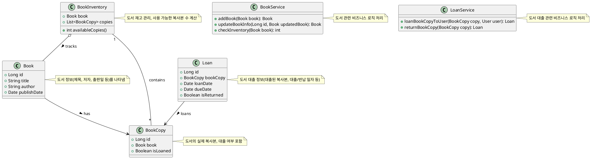
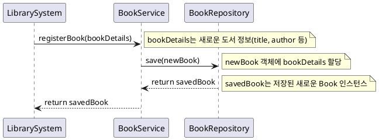

# 도서 관리 TDD 예제

## 개요

- controller → application servier → domain(entity, value object, domain service, repository interface) → repository
  implementation
  의 구조를 갖는 spring-boot, jpa 등을 이용한 웹 어플리케이션 예제를 TDD를 활용해서 구현하는 예제
- 다음과 같은 과정을 보여주는 것에 주안함

1. `Outside in TDD` 방식으로 controller에서 Domain으로 들어가면서 Iteratively Discover Interface하고,
2. `Inside Out`으로 Domain에서 Controller로 나오면서 1에서 사용한 Mock 객체들을 real 객체로 치환

- 기본적으로 2가지 접근법이 가능

1. Mock을 최대한 사용: MockMvc, WebMvcTest, MockBean을 활용
2. Mock을 최소한 사용: Acceptance Test, Integration Test, JPA 활용

## 구현

### 신규 도서 정보 등록

#### 정적 모델링
- 주요 클래스 및 관계

| 클래스 | 설명 |
| --- | --- |
| Book | 도서 정보를 나타내는 기본 클래스입니다. 제목, 저자, 출판일 등의 필드를 포함합니다. |
| BookCopy | Book의 실제 복사본을 나타냅니다. 각 복사본은 고유한 ID를 가지며, 대출 상태를 관리합니다. |
| BookInventory | 도서의 재고 관리를 담당합니다. 특정 Book의 모든 BookCopy를 추적하고, 재고 수량을 관리합니다. |
| Loan | 도서 대출 정보를 나타내는 클래스입니다. 대출한 BookCopy와 대출자 정보, 대출 기간 등을 포함합니다. |

#### 동적 모델링

##### Use Cases
- Happy Case: 도서 추가 성공

1. 사용자 (관리자)가 시스템에 로그인합니다.
2. 사용자는 "도서 추가" 기능을 선택합니다.
3. 시스템은 도서 정보 입력 폼을 제공합니다.
4. 사용자는 도서의 제목, 저자, 출판일, 재고 수량 등 필요한 정보를 입력합니다.
5. 사용자는 "추가" 버튼을 클릭합니다.
6. 시스템은 입력된 정보를 검증합니다.
7. 시스템은 도서 정보를 데이터베이스에 저장합니다.
8. 시스템은 사용자에게 도서 추가 성공 메시지를 표시합니다.

- Alternative Case 1: 필수 정보 누락

  - 4-a. 사용자가 필수 정보 중 일부를 입력하지 않고 "추가" 버튼을 클릭했습니다.

  1. 시스템은 어떤 필수 정보가 누락되었는지를 표시하며, 도서 추가 실패 메시지를 사용자에게 알립니다.
  2. 사용자는 누락된 정보를 입력한 후 다시 "추가" 버튼을 클릭할 수 있습니다.
  3. 시나리오는 6단계로 돌아갑니다.

- Alternative Case 2: 도서 정보 중복

  - 7-a. 시스템이 입력된 도서 정보가 이미 데이터베이스에 존재하는 것을 발견했습니다.

  1. 시스템은 도서 정보 중복 메시지를 사용자에게 알립니다.
  2. 사용자는 정보를 수정하거나 취소할 수 있습니다.
  3. 사용자가 정보를 수정하여 다시 "추가" 버튼을 클릭하면, 시나리오는 6단계로 돌아갑니다.

- Alternative Case 3: 시스템 오류 또는 네트워크 문제

  - 8-a. 시스템 오류 또는 네트워크 문제로 인해 도서 정보 저장이 실패했습니다.

  1. 시스템은 오류 메시지를 사용자에게 알립니다.
  2. 사용자는 다시 시도하거나, 문제가 지속될 경우 시스템 관리자에게 문의할 수 있습니다.
  3. 사용자가 다시 시도를 선택한 경우, 시나리오는 4단계로 돌아갑니다.

### Acceptance Test

- REST Assured로 실제 http rest 호출을 하는 테스트 작성
- 이 테스트에서는 mock을 이용할 수 없음

### WebMvcTest Test

- repository를 mock으로 만들어서 controller를 테스트

## Issue
- layered architecture에서는 Mock Test 접근이 적합
- vertical slicing architecture에서는 Acceptance Test 접근이 적합
  - JPA 보다 Stub을 사용하는 것이 더 나을 듯